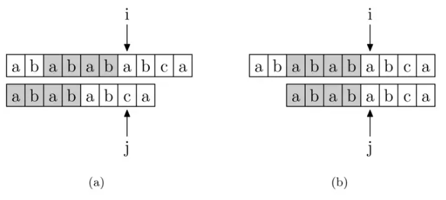
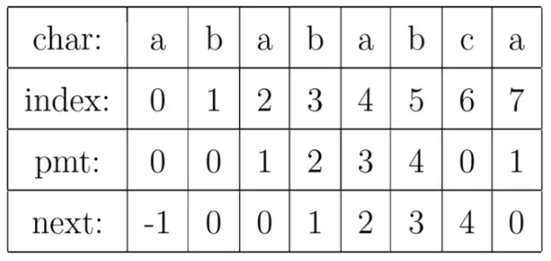
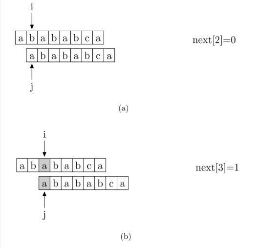
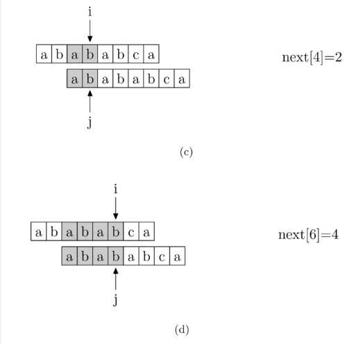
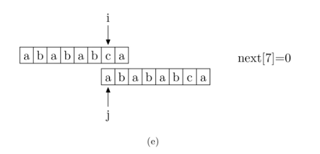

+++
title = "【Learning】KPM的一些理解"
date = 2025-03-17
description = "kpm算法"
taxonomies = { tags = ["algo"] }
template = "blog-page.html"
draft = false

+++

# KMP理解

Knuth-Morris-Pratt (KMP) 字符串匹配算法

## 概念

### PMT

KMP算法的核心，是一个被称为**部分匹配表**(**P**artial **M**atch **T**able)的数组。

对于字符串“abababca”，它的PMT如下表所示：


就像例子中所示的，如果待匹配的模式字符串有8个字符，那么PMT就会有8个值。

先解释一下字符串的**前缀**和**后缀**。

如果字符串A和B，存在A=BS，其中S是任意的**非空字符串**，那就称B为A的**前缀**。

**例如**，”Harry”的前缀包括{”H”, ”Ha”, ”Har”, ”Harr”}，把所有前缀组成的集合，称为字符串的前缀集合。

同样可以定义后缀A=SB， 其中S是任意的**非空字符串**，那就称B为A的**后缀**，

**例如**，”Potter”的后缀包括{”otter”, ”tter”, ”ter”, ”er”, ”r”}，然后把所有后缀组成的集合，称为字符串的后缀集合。

*要注意的是，字符串本身并不是自己的后缀。*

（通常我们讨论后缀时指的是**真子串**

有了这个定义，就可以说明PMT中的值的意义了。**PMT中的值是字符串的前缀集合与后缀集合的交集中最长元素的长度**。

**例如**，对于”aba”，它的前缀集合为{”a”, ”ab”}，后缀 集合为{”ba”, ”a”}。

两个集合的交集为{”a”}，那么长度最长的元素就是字符串”a”了，长 度为1，所以对于”aba”而言，它在PMT表中对应的值就是1。

**再比如**，对于字符串”ababa”，它的前缀集合为{”a”, ”ab”, ”aba”, ”abab”}，它的后缀集合为{”baba”, ”aba”, ”ba”, ”a”}， 两个集合的交集为{”a”, ”aba”}，其中最长的元素为”aba”，长度为3。


## 理解

如何使用这个表来加速字符串的查找，以及这样用的道理是什么。

要在主字符串"ab**abababca**"中查找模式字符串"**abababca**"。

如果在 j 处字符不匹配，那么由于前边所说的模式字符串 PMT 的性质，主字符串中 i 指针之前的 PMT[j −1] 位就一定与模式字符串的第 0 位至第 PMT[j−1] 位是相同的。

这是因为主字符串在 i 位失配，也就意味着主字符串从 i−j 到 i 这一段是与模式字符串的 0 到 j 这一段是完全相同的。

模式字符串从 0 到 j−1 ，在这个例子中就是”ababab”，其**前缀集合**与**后缀集合**的**交集**的**最长元素**为”abab”， 长度为**4**。

所以就可以断言，主字符串中i指针之前的 4 位一定与模式字符串的第0位至第 4 位是相同的，即长度为 4 的后缀与前缀相同。这样一来，我们就可以将这些字符段的比较省略掉。

具体的做法是，保持i指针不动，然后将j指针指向模式字符串的PMT[j −1]位即可

简言之，以图中的例子来说，在 i 处失配，那么主字符串和模式字符串的前边6位就是相同的。

又因为模式字符串的前6位，它的前4位前缀和后4位后缀是相同的，所以我们推知主字符串i之前的4位和模式字符串开头的4位是相同的。

就是图中的灰色部分。那这部分就不用再比较了。




如果是在 j 位 失配，那么影响 j 指针回溯的位置的其实是第 j −1 位的 PMT 值，所以为了编程的方便， 我们不直接使用PMT数组，而是将PMT数组向后偏移一位。**新得到的这个数组就是next数组**。

### next数组

KMP算法中的**next数组**（也称为部分匹配表或前缀函数）是算法高效性的核心。

它通过预处理模式串（pattern），记录每个位置的最长公共前后缀长度，从而在匹配失败时快速跳过不必要的比较。

#### **1. next数组的定义**

对于模式串 `p` 的每个位置 `i`，`next[i]` 表示：

- **`p[0...i-1]`** 这个子串中，**最长的相同前缀和后缀的长度**。
- **前缀**：从第一个字符开始的连续子串。
- **后缀**：从最后一个字符向前结束的连续子串。

**示例**：
若 `p = "ABABC"`，则：

- `next[4]` 对应子串 `"ABAB"`，其最长公共前后缀为 `"AB"`，长度为2，故 `next[4] = 2`。

------

#### **2. next数组的计算方法**

通过双指针法（`i` 和 `j`）遍历模式串，动态计算每个位置的 `next` 值：

1. 初始化：
   - `next[0] = 0`（无前缀或后缀）。
   - `j = 0`（前缀指针），`i = 1`（后缀指针）。
2. 遍历模式串：
   - 若 `p[i] == p[j]`：
     - `j++`（前缀长度+1）。
     - `next[i] = j`。
     - `i++`。
   - 若 `p[i] != p[j]`：
     - **若 `j > 0`**：`j = next[j-1]`（回退到前一个最长前缀的末尾）。
     - **若 `j == 0`**：`next[i] = 0`，`i++`。

#### **3. next数组在KMP算法中的应用**

当主串 `s` 与模式串 `p` 匹配失败时（即 `s[i] ≠ p[j]`），利用 `next[j-1]` 调整模式串的位置：

1. **将模式串的起始位置移动到 `next[j-1]`**。
2. **跳过已匹配的重复前缀**，避免回溯主串。

**示例**：
主串 `s = "ABABABC"`，模式串 `p = "ABABC"`，`next = [0,0,1,2,0]`。

- 当 `j=4`（`p[4]='C'`）与主串不匹配时，回退到 `j = next[3] = 2`，继续匹配。


#### **4. next数组的优化变体**

某些实现中，`next` 数组会右移一位（从索引1开始），使代码更简洁。例如：

- 原 `next` 数组：`[0,0,0,0,1,2,0]`
- 优化后：`[-1,0,0,0,0,1,2]`（`next[0] = -1`，其他值右移）。


#### **5. next数组的意义**

- **避免主串回溯**：传统暴力算法需回溯主串，而KMP通过 `next` 数组仅回溯模式串。
- **时间复杂度优化**：预处理 `next` 数组为 O(m)，匹配过程为 O(n)，总时间复杂度 O(n+m)。


要注意的一个技巧是，在把PMT进行向右偏移时，第0位的值，将其设成了-1，这只是为了编程的方便，并没有其他的意义。next数组如下表所示。



求next数组的过程完全可以看成字符串匹配的过程，即以模式字符串为主字符串，以模式字符串的前缀为目标字符串，一旦字符串匹配成功，那么当前的next值就是匹配成功的字符串的长度。

从模式字符串的第一位(注意，不包括第0位)开始对自身进行匹配运算。

 在任一位置，能匹配的最长长度就是当前位置的next值








## 实现

```c
#include <stdio.h>
#include <string.h>
 
// 计算 next 数组
void computeNextArray(char *p, int *next, int m) {
    int len = 0; // length of the previous longest prefix suffix
    next[0] = -1; // next[0] is always -1
    int i = 1;
    while (i < m) {
        if (p[i] == p[len]) {
            len++;
            next[i] = len;
            i++;
        } else {
            if (len != 0) {
                len = next[len - 1];
            } else {
                next[i] = 0;
                i++;
            }
        }
    }
}
 
// KMP 字符串匹配函数
int KMP(char *t, char *p) {
    int n = strlen(t);
    int m = strlen(p);
    if (m == 0) return 0; // 空模式串匹配在起始位置
    int next[m];
    computeNextArray(p, next, m);
 
    int i = 0; // index for t[]
    int j = 0; // index for p[]
    while (i < n && j < m) {
        if (j == -1 || t[i] == p[j]) {
            i++;
            j++;
        } else {
            j = next[j];
        }
    }
 
    if (j == m)
        return i - j; // match found, return start index
    else
        return -1; // match not found
}
 
int main() {
    char t[] = "hello world";
    char p[] = "world";
    int index = KMP(t, p);
    printf("Pattern found at index %d\n", index);
    return 0;
}
```